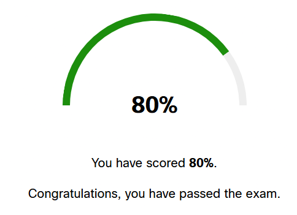
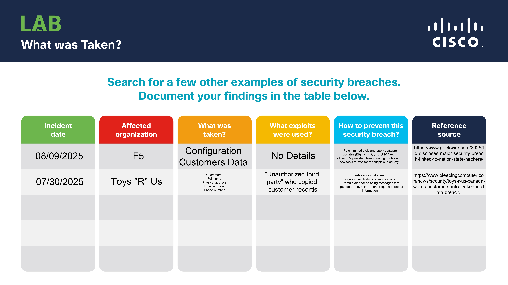

## 📅 Daily Cybersecurity Progress Log

## Day 1: Completed Cisco Intro to Cybersecurity Module 1 (80% Quiz Score)

**Date:** 10/23/2025

---

### 🎯 Today's Achievement:

* Completed Cisco NetAcad Module 1: Introduction to Cybersecurity, achieving .
* Successfully navigated all sections within Module 1:
    * 1.1 The World of Cybersecurity
    * 1.2 Organizational Data
    * 1.3 What Was Taken? (Lab) & 
    * 1.4 Cyber Attackers
    * 1.5 Cyberwarfare
* Analyzed two real-world security breaches (F5 and Toys “R” Us Canada) as part of the "What was Taken?" lab.

### 💡 Key Concepts Learned:

| Concept/Topic | Brief Definition/Summary |
| :--- | :--- |
| **Cybersecurity Fundamentals** | Understanding personal data protection, online identity, data location, smart device security, and motivations behind hacking and identity theft. |
| **Organizational Data & Breaches** | Explored types of organizational data, the importance of data security ("The Cube"), and the consequences of security breaches. |
| **Cyber Attackers** | Identified different types of threat actors, including "white hat" vs. "black hat" hackers, and internal vs. external threats. |
| **Cyberwarfare** | Examined the concept of nation-state-sponsored cyber-attacks, including a case study on Stuxnet, and the purposes of such digital conflicts. |
